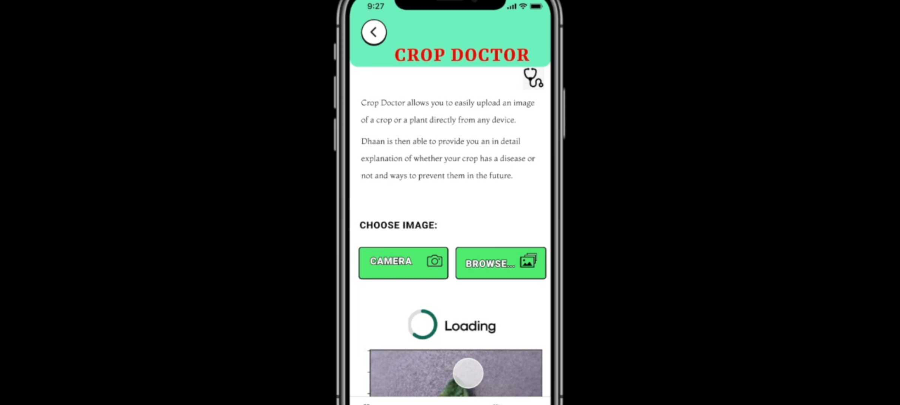
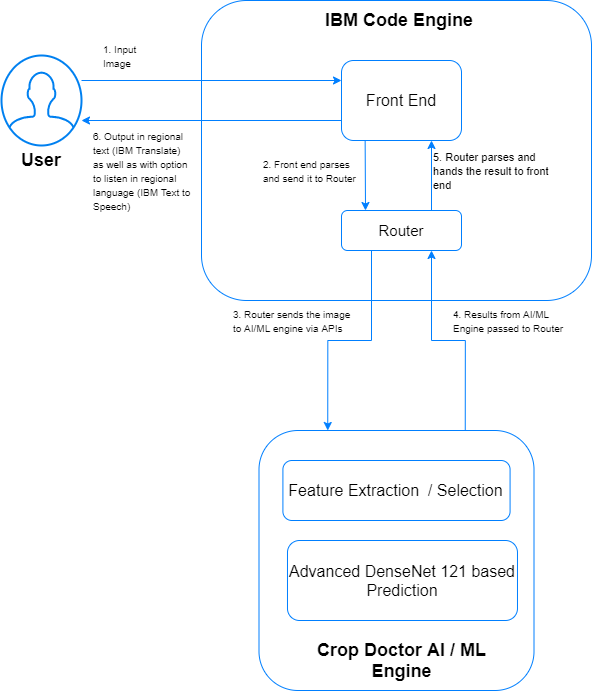
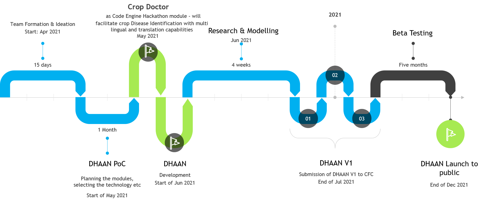

# CROP Doctor by DHAAN
## The moto of CROP Doctor is CURE.
## Click! Upload! Recommend! Educate!

## Contents

1. [Short description](#short-description)
1. [Demo video](#demo-video)
1. [The architecture](#the-architecture)
1. [Long description](#long-description)
1. [Project roadmap](#project-roadmap)
1. [Getting started](#getting-started)
1. [Live demo](#live-demo)
1. [Built with](#built-with)
1. [Authors](#authors)
1. [License](#license)
1. [Acknowledgments](#acknowledgments)

## Short description
Identify plant diseases with our super advanced AI tool.
### What's the problem?
FAO estimates that annually between 20 to 40 percent of global crop production are lost to pests. Each year, plant diseases cost the global economy around $220 billion, and invasive insects around US$70 billion. As per UN, there are about 821 million people estimated to be chronically undernourished and over 90 million children under five are dangerously underweight. This is not only affecting the farmers but all the living being of our planet by creating scarity of food and leading hunger, mal nourishment etc.

### How can technology help?

With Dhaan – we plan to use technology for helping the farmers to produce organic food produce, connecting coops to farmers effectively and enabling the general public to get access to nutritious and organically grown food without any hassle. Moreover we will be enabling the public to donate excess food that they have thus bringing in a balance.
Dhaan will be in alignment of UN’s SDG goal of ending all forms of hunger and malnutrition by 2030, making sure all people–especially children–have sufficient and nutritious food all year. 

And as sub module of DHAAN we have developed Crop Doctor to identify plant diseases in wide variety of plants.

### The idea

It's imperative that enabling access to healthy and nourished food is the crux of a food chain.  With Crop Dr, we are providing a set of open source tools, backed by IBM Cloud and Watson Services, will empower farmers to grow crops with appropriate protection from dieases.

## Demo video

## The architecture

1. The user navigates to the app and uploads an image file.
2. Within the code engine, front end parses and send it to Router.
3. The Router processes it and sends the image to AI/ML engine via APIs
4. The AI/ML engine performs feature selection / extraction etc then predicts using the Densenet121 algorithm
5. Router parses and hands the result to front end
6. Output is given to the user in regional text (IBM Translate) as well as with option to listen in regional language (IBM Text to Speech)

## Long description

Crop Doctor (a sub module of DHAAN) allows the user to easily upload an image of a crop or a plant directly from any device. 

Once uploaded, Crop Doctor is then able to provide an in depth explanation of whether the crop has a disease or not and organic/traditional ways to prevent them in the future. 
To achieve the same Crop Doctor uses state of the art Densenet 121 algorithm for prediction combined with IBM code engine that makes deployment a breeze. Also by using IBM Translate and IBM Text to Speech, Crop Doctor will provide a hyper personalized end user experience.

With this, Crop Doctor helps farmers to tackle the high level of uncertainty  and destruction in crop plantations.

## Project roadmap

The project currently does the following things.

- Crop disease identification using Densenet121 alogorithm
- Recommended methods to prevent the disease
- English to Hindi coversion of the results text using IBM Text to Text translate (Note: PoC tested successfully and needs integration)
- English to German conversoin of the results to audio (in mp3 format) using IBM Text to Speech audio services (Note: PoC tested successfully and needs integration)

Currently the front end and the router component of the architecture is hosted in IBM code engine and the AI prediction is happening outside IBM cloud. In the future we plan to run the AI prediction also within IBM cloud, for example.

Key Future work includes: 
- Integration of English to Hindi coversion of the results text using IBM Text to Text translate to the front end
- English to German conversoin of the results to audio (in mp3 format) using IBM Text to Speech audio services to the front end
- Develop the DHAAN app to provide additonal services

See below for our proposed schedule on next steps after Call for Code 2021 submission.

## Getting started

## Setup

This code works on Python3+ versions.

## Clone the repository

## With Docker:

$ git clone https://github.com/zero-hunger-cfc-2k21/DHAAN-Plant-Disease-Prediction-Model.git 

$ DHAAN-Plant-Disease-Prediction-Model/

## Install Docker
https://docs.docker.com/engine/install/ubuntu/

## Build docker image

$ docker build -t dhaan_docker .

Note: ensure in app.py port is mentiond as 8080

$ docker run -it -p 8080:8080 dhaan_docker

In Browser run with 127.0.0.1:8080

## To push:

$docker login

  Username: XXXX
  
  Password: XXXX
  
$ docker tag dhaan_docker dhaan/dhaan_docker:1.0.0

$ docker push dhaan/dhaan_docker:1.0.0

## Without Docker:

## Install the required libraries

$ pip3 install -r requirements.txt

## Clone the repository

$ git clone https://github.com/zero-hunger-cfc-2k21/DHAAN-Plant-Disease-Prediction-Model.git

$ DHAAN-Plant-Disease-Prediction-Model/

## Run app.py

$ python3 app.py 

or

$ python -m flask run

In Browser run with 127.0.0.1:5000

## Live Demo Url:

https://app-c1.a3bnbtend2e.jp-tok.codeengine.appdomain.cloud/

## Built with

- [IBM Cloud](https://cloud.ibm.com/) - Hosted in IBM Cloud
- [IBM Code Engine](https://cloud.ibm.com/login?redirect=%2Fcodeengine%2Flanding) - Deployment platform
- [IBM Text to Speech](https://cloud.ibm.com/catalog/services/text-to-speech) - For converting results into speech audio in regional languages
- [IBM Language Translator](https://cloud.ibm.com/catalog/services/language-translator) - For converting results from English to regional languages
- [Figma](www.figma.com) - For UI design
- [Keras Framework](https://keras.io) - For AI/ML modelling
- [Densenet121](https://keras.io/api/applications/densenet/) - For prediction
- Trained Model Url : https://drive.google.com/file/d/1WF8kWRRYEUt3zxgRUBJdY93P4KWlfCC2/view?usp=sharing

## Authors
- **Suneetha Jonadula** - _Lead Developer_
- **Bharathi Athinarayanan** - _Architect_ 
- **Furqan Yaqub Khan** - _Backend Engineer_
- **Zaynob Sumon** - _UI/UX Designer_

## License

This project is licensed under the Apache 2 License - see the [LICENSE](LICENSE) file for details.

## Acknowledgments

- Ms. Rema - Agri expert ( http://www.isdindia.org/)
